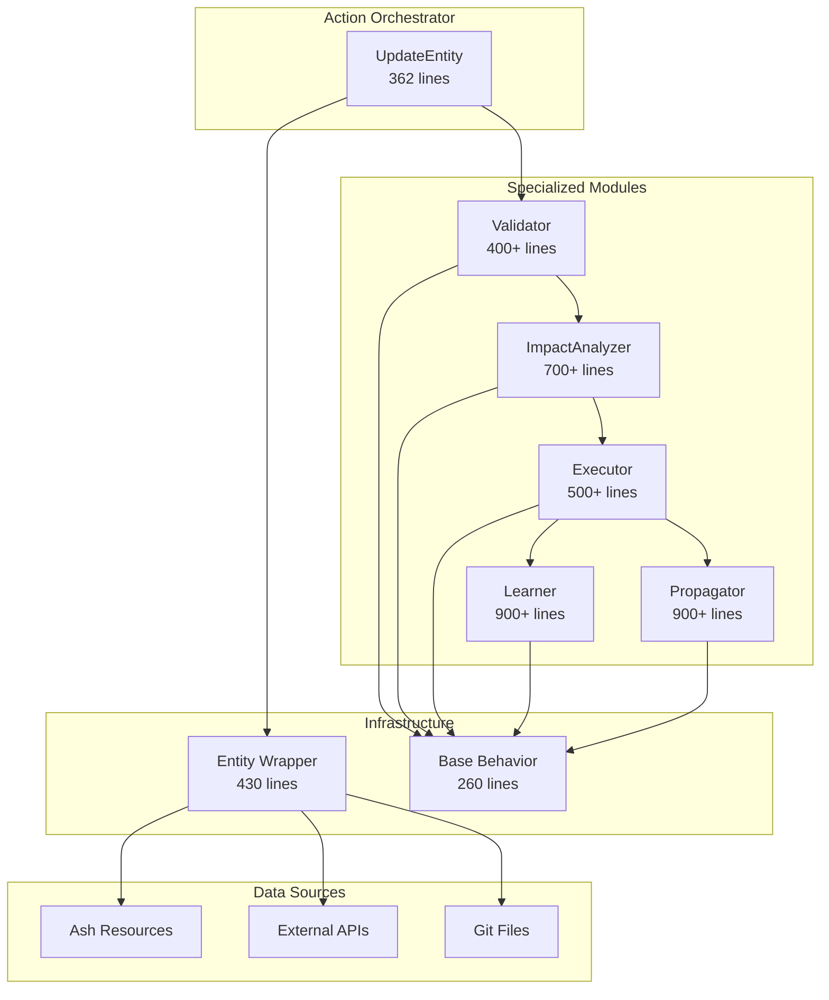

# Action Framework Architecture

## Overview

The RubberDuck Action Framework provides a modular, extensible system for executing complex operations with impact assessment, learning capabilities, and change propagation. The framework follows a clean architecture pattern with specialized modules handling distinct responsibilities.

## Architecture Diagram



## Core Components

### 1. UpdateEntity Orchestrator
**Location:** `lib/rubber_duck/actions/core/update_entity.ex`  
**Size:** 362 lines (reduced from 1005 lines - 64% reduction)

The thin orchestrator that coordinates the update pipeline:
- Prepares parameters
- Manages pipeline flow
- Handles errors and rollback
- Returns unified responses

```elixir
def run(params, context) do
  params
  |> prepare_params()
  |> execute_pipeline(context)
  |> handle_result(params, context)
end
```

### 2. Validator Module
**Location:** `lib/rubber_duck/actions/core/update_entity/validator.ex`  
**Responsibility:** Input validation and sanitization

Key features:
- Field validation against entity schemas
- Constraint checking (min/max, patterns, etc.)
- Compatibility verification
- Security validation for sensitive fields

### 3. ImpactAnalyzer Module
**Location:** `lib/rubber_duck/actions/core/update_entity/impact_analyzer.ex`  
**Responsibility:** Comprehensive impact assessment

Analyzes 7 dimensions:
- Direct impact on the entity
- Dependency impact on related entities
- Performance implications
- System-wide effects
- Risk assessment
- Affected entity identification
- Propagation requirements

### 4. Executor Module
**Location:** `lib/rubber_duck/actions/core/update_entity/executor.ex`  
**Responsibility:** Safe change execution

Features:
- Snapshot creation for rollback
- Version management
- Atomic updates
- Integrity verification
- Audit trail generation

### 5. Learner Module
**Location:** `lib/rubber_duck/actions/core/update_entity/learner.ex`  
**Responsibility:** Pattern recognition and learning

Capabilities:
- Outcome tracking
- Pattern analysis
- Accuracy measurement
- Feedback processing
- Model updates
- Improvement suggestions

### 6. Propagator Module
**Location:** `lib/rubber_duck/actions/core/update_entity/propagator.ex`  
**Responsibility:** Change propagation to dependent entities

Features:
- Propagation plan creation
- Circular dependency detection
- Multiple execution strategies (sequential, parallel, batched)
- Validation and verification
- Queue management

### 7. Entity Wrapper
**Location:** `lib/rubber_duck/actions/core/entity.ex`  
**Responsibility:** Unified interface for heterogeneous data sources

Provides:
- Ash resource wrapping
- External data integration
- Runtime metadata attachment
- Snapshot/restore capabilities
- Cross-domain coordination

### 8. Base Behavior
**Location:** `lib/rubber_duck/actions/base.ex`  
**Responsibility:** Common patterns for all actions

Includes:
- Delegation macros
- Pipeline helpers
- Rollback support
- Telemetry integration

## Pipeline Flow

```
1. Entity Fetch (via Entity Wrapper)
   ↓
2. Validation (Validator Module)
   ↓
3. Impact Analysis (ImpactAnalyzer Module)
   ↓
4. Goal Alignment Check
   ↓
5. Change Execution (Executor Module)
   ↓
6. Propagation (Propagator Module) [if enabled]
   ↓
7. Learning (Learner Module) [if enabled]
   ↓
8. Response Building
```

## Key Design Patterns

### 1. Delegation Pattern
Modules are called through a clean delegation interface:
```elixir
delegate_to Validator, :validate, as: :validate_changes
delegate_to ImpactAnalyzer, :analyze, as: :analyze_impact
```

### 2. Pipeline Pattern
Operations flow through a pipeline with error handling:
```elixir
params
|> fetch_entity()
|> maybe_continue(&validate_and_prepare/1)
|> maybe_continue(&assess_impact/1)
|> maybe_continue(&execute_changes/1)
```

### 3. Entity Abstraction
The Entity wrapper provides a unified interface:
```elixir
# Works with Ash resources
{:ok, entity} = Entity.fetch(:user, "123")

# Works with external data
entity = Entity.from_external(api_data, :external_resource, "456")
```

## Configuration Options

### Required Parameters
- `entity_id`: Unique identifier of the entity
- `entity_type`: Type of entity (:user, :project, :code_file, :analysis)
- `changes`: Map of fields to update

### Optional Parameters
- `impact_analysis`: Enable/disable impact assessment (default: true)
- `auto_propagate`: Enable/disable automatic propagation (default: false)
- `learning_enabled`: Enable/disable learning capture (default: true)
- `agent_goals`: List of goals for alignment checking
- `rollback_on_failure`: Enable/disable rollback (default: true)
- `validation_config`: Custom validation constraints

## Usage Examples

### Basic Update
```elixir
params = %{
  entity_id: "user-123",
  entity_type: :user,
  changes: %{username: "new_username"},
  impact_analysis: false,
  auto_propagate: false,
  learning_enabled: false
}

{:ok, result} = UpdateEntity.run(params, %{})
```

### Full-Featured Update
```elixir
params = %{
  entity_id: "project-456",
  entity_type: :project,
  changes: %{
    status: :archived,
    name: "Archived Project"
  },
  impact_analysis: true,
  auto_propagate: true,
  learning_enabled: true,
  agent_goals: [
    %{type: :quality, priority: :high},
    %{type: :stability, priority: :critical}
  ],
  rollback_on_failure: true,
  validation_config: %{
    constraints: %{
      name: %{min: 3, max: 100}
    }
  }
}

{:ok, result} = UpdateEntity.run(params, %{})

# Result includes:
# - Updated entity
# - Impact assessment details
# - Propagation results
# - Learning data captured
# - Goal alignment score
```

## Performance Characteristics

Based on integration testing:
- Simple updates: < 100ms
- Complex updates with full pipeline: < 1 second
- Concurrent updates: Successfully handled
- Large change sets (50+ fields): Processed efficiently

## Error Handling

The framework provides comprehensive error handling:

### Validation Errors
```elixir
{:error, %{
  step: :validation,
  reason: %{
    reason: :validation_failed,
    validations: %{...},
    failed_checks: [...]
  },
  entity_id: "...",
  entity_type: :...
}}
```

### Goal Misalignment
```elixir
{:error, %{
  step: :goal_alignment,
  reason: %{
    reason: :goal_misalignment,
    alignment_score: 0.4,
    recommendation: "..."
  }
}}
```

### Execution Failures
```elixir
{:error, %{
  step: :execution,
  reason: %{...},
  entity_id: "...",
  entity_type: :...
}}
# Automatic rollback triggered if configured
```

## Testing

The framework includes comprehensive test coverage:
- Unit tests for each specialized module
- Integration tests for end-to-end flows
- Performance benchmarks
- Concurrent update testing

Test statistics:
- Validator: 24 tests
- ImpactAnalyzer: 28 tests
- Executor: 30 tests
- Learner: 40 tests
- Propagator: 33 tests
- Integration: 16 tests
- **Total: 171+ tests**

## Migration Guide

### From Old UpdateEntity to New Framework

Old approach (monolithic):
```elixir
# 1005 lines of mixed concerns
UpdateEntity.update(entity, changes, opts)
```

New approach (modular):
```elixir
# Clean parameter structure
params = %{
  entity_id: entity.id,
  entity_type: entity.type,
  changes: changes,
  # Explicit configuration
  impact_analysis: true,
  auto_propagate: false
}

# Single entry point
{:ok, result} = UpdateEntity.run(params, context)
```

### Key Differences
1. **Explicit Configuration**: All options are clearly defined
2. **Pipeline Visibility**: Each stage is traceable
3. **Modular Testing**: Test individual components
4. **Better Error Messages**: Clear indication of failure point
5. **Performance Monitoring**: Built-in telemetry support

## Future Enhancements

### Planned Improvements
1. **Ash Integration**: Full integration with Ash domains when configured
2. **Caching Layer**: Add caching for frequently accessed entities
3. **Batch Operations**: Support for bulk updates
4. **Async Propagation**: Background job support for large propagations
5. **ML Integration**: Advanced pattern recognition and prediction

### Extension Points
The framework is designed for extensibility:
- Add new entity types in Entity wrapper
- Create custom validators
- Implement domain-specific impact analyzers
- Add specialized propagation strategies
- Extend learning algorithms

## Best Practices

### 1. Use Minimal Configuration
Start with minimal configuration and add features as needed:
```elixir
# Start simple
params = %{
  entity_id: id,
  entity_type: type,
  changes: changes,
  impact_analysis: false,
  auto_propagate: false,
  learning_enabled: false
}
```

### 2. Enable Features Progressively
Add features based on requirements:
- Enable `impact_analysis` for critical updates
- Enable `auto_propagate` for dependent entity updates
- Enable `learning_enabled` for pattern recognition

### 3. Define Clear Goals
When using goal alignment:
```elixir
agent_goals: [
  %{type: :quality, priority: :high, threshold: 0.8},
  %{type: :performance, priority: :medium, threshold: 0.6}
]
```

### 4. Use Validation Constraints
Define constraints for data integrity:
```elixir
validation_config: %{
  constraints: %{
    email: %{pattern: ~r/@/, required: true},
    age: %{min: 0, max: 150},
    status: %{values: [:active, :inactive, :archived]}
  }
}
```

## Conclusion

The refactored Action Framework provides a clean, modular, and extensible architecture for complex update operations. With a 64% reduction in code complexity and comprehensive test coverage, it offers:

- **Maintainability**: Clear separation of concerns
- **Testability**: Isolated, focused modules
- **Performance**: Optimized pipeline execution
- **Extensibility**: Easy to add new capabilities
- **Reliability**: Comprehensive error handling and rollback

The framework is production-ready and provides a solid foundation for building complex, intelligent update operations in the RubberDuck system.