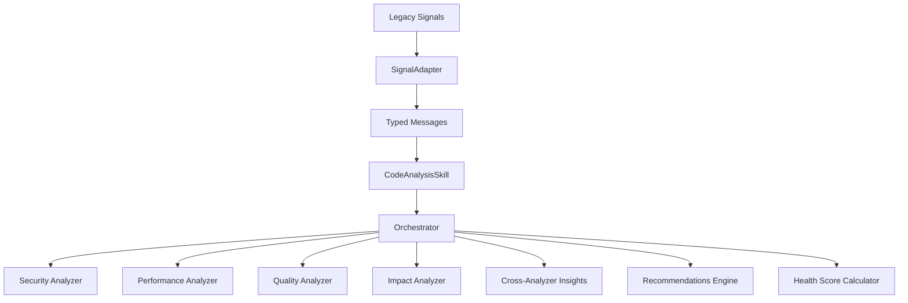

# Code Analysis System Architecture

## Overview

The Code Analysis System provides comprehensive code quality, security, performance, and impact analysis through a modular, extensible architecture. The system has been refactored from a monolithic skill into focused, composable analyzers coordinated by an intelligent orchestrator.

## Architecture Components



## Core Components

### 1. CodeAnalysisSkill (`lib/rubber_duck/skills/code_analysis_skill.ex`)

The main entry point for code analysis requests. Responsibilities:
- Receives typed messages (Analyze, QualityCheck, SecurityScan, etc.)
- Routes requests to the Orchestrator
- Maintains analysis history
- Handles both Base module integration and test contexts

**Key Features:**
- Version 3.0.0 - Fully migrated to typed messages
- No legacy signal handlers
- Delegates all analysis to specialized analyzers via Orchestrator

### 2. Orchestrator (`lib/rubber_duck/analyzers/orchestrator.ex`)

Coordinates multiple analyzers to provide comprehensive analysis. Responsibilities:
- Creates execution plans based on analysis strategy
- Manages parallel and sequential analyzer execution
- Generates cross-analyzer insights
- Prioritizes and consolidates recommendations
- Calculates overall health scores

**Execution Strategies:**
- **Quick**: Minimal analysis for fast feedback
- **Standard**: Balanced analysis with moderate depth
- **Deep**: Thorough analysis with all analyzers
- **Focused**: Target specific areas based on initial findings
- **Adaptive**: Dynamically adjusts based on discovered issues

### 3. Individual Analyzers

#### Security Analyzer (`lib/rubber_duck/analyzers/code/security.ex`)
Detects security vulnerabilities and unsafe patterns:
- SQL injection detection
- Command injection risks
- Hardcoded secrets
- Authentication issues
- Input validation problems
- CWE category mapping

#### Performance Analyzer (`lib/rubber_duck/analyzers/code/performance.ex`)
Identifies performance bottlenecks and optimization opportunities:
- Algorithmic complexity analysis (O(n), O(n²), etc.)
- Database query optimization
- Memory usage patterns
- Bottleneck detection
- Optimization potential scoring (0-100)

#### Quality Analyzer (`lib/rubber_duck/analyzers/code/quality.ex`)
Evaluates code quality and maintainability:
- Cyclomatic complexity
- Code duplication detection
- Documentation coverage
- Maintainability index calculation
- Technical debt indicators
- Testing recommendations

#### Impact Analyzer (`lib/rubber_duck/analyzers/code/impact.ex`)
Assesses the impact of code changes:
- Change scope analysis (minimal, moderate, extensive)
- Dependency impact assessment
- Risk level calculation
- Effort estimation
- Rollback complexity evaluation

## Message System

### Typed Messages

The system uses strongly-typed messages for all operations:

```elixir
# Comprehensive analysis
%Analyze{
  file_path: "/lib/module.ex",
  analysis_type: :comprehensive,
  depth: :deep,
  auto_fix: false
}

# Security-focused scan
%SecurityScan{
  content: code_content,
  file_type: :elixir
}

# Quality check
%QualityCheck{
  target: "module.ex",
  metrics: [:complexity, :coverage, :duplication],
  thresholds: %{complexity: 10, coverage: 0.8}
}
```

### Pattern Matching Support

The system includes wildcard pattern matching for flexible routing:

```elixir
# PatternMatcher handles wildcards
"code.*"           # Matches all code-related messages
"code.analyze.*"   # Matches all analyze subtypes
"*.security.*"     # Matches any security-related messages
```

## Analysis Workflow

### 1. Request Reception
```elixir
# Message arrives at CodeAnalysisSkill
message = %Analyze{file_path: "app.ex", analysis_type: :comprehensive}
CodeAnalysisSkill.handle_analyze(message, context)
```

### 2. Orchestration
```elixir
# Orchestrator creates execution plan
request = %{
  file_path: "app.ex",
  analyzers: [:security, :performance, :quality, :impact],
  strategy: :standard
}
Orchestrator.orchestrate(request)
```

### 3. Parallel/Sequential Execution
```elixir
# Based on strategy, analyzers run in phases
# Phase 1: Quick analyzers (parallel)
[quality_result, security_result] = run_parallel([Quality, Security])

# Phase 2: Dependent analyzers (sequential)
performance_result = run_with_context(Performance, initial_results)
impact_result = run_with_context(Impact, all_results)
```

### 4. Insight Generation
```elixir
# Cross-analyzer insights are generated
insights = [
  %{
    type: :security_performance_tradeoff,
    message: "Security fixes may impact performance",
    source_analyzers: [:security, :performance]
  }
]
```

### 5. Result Consolidation
```elixir
# Final result with health scores
%{
  results: individual_results,
  insights: cross_analyzer_insights,
  recommendations: prioritized_actions,
  overall_health: %{
    overall: 0.85,
    security: 0.7,
    performance: 0.9,
    quality: 0.8,
    maintainability: 0.95
  }
}
```

## Health Score Calculation

Health scores are calculated using weighted averages:

- **Security**: Based on vulnerability count and severity
  - 0 vulnerabilities = 1.0
  - 1-2 vulnerabilities = 0.7
  - 3-5 vulnerabilities = 0.4
  - 6+ vulnerabilities = 0.1

- **Performance**: Based on optimization potential
  - Score = 1.0 - (optimization_potential / 100)

- **Quality**: Based on complexity, coverage, and duplication
  - Uses maintainability index formula

- **Overall**: Weighted combination
  - Security: 30%
  - Quality: 30%
  - Performance: 20%
  - Maintainability: 20%

## Configuration

### Skill Options
```elixir
opts_schema: [
  enabled: [type: :boolean, default: true],
  depth: [type: :atom, default: :moderate, values: [:shallow, :moderate, :deep]],
  auto_fix: [type: :boolean, default: false],
  impact_analysis: [type: :boolean, default: true],
  performance_check: [type: :boolean, default: true],
  security_scan: [type: :boolean, default: true],
  dependency_tracking: [type: :boolean, default: true]
]
```

## Error Handling

The system includes comprehensive error handling:

1. **Analyzer Timeouts**: Each analyzer has configurable timeouts
2. **Graceful Degradation**: Missing analyzers don't break the flow
3. **Default Values**: Sensible defaults for missing data
4. **Error Propagation**: Errors are logged and reported

## Testing

The system includes extensive test coverage:

- Unit tests for each analyzer
- Integration tests for orchestration
- End-to-end workflow tests
- Error handling and edge case tests

See `test/rubber_duck/skills/code_analysis_skill_orchestrator_test.exs` for comprehensive examples.

## Performance Considerations

1. **Parallel Execution**: Independent analyzers run concurrently
2. **Caching**: Analysis results are cached in state
3. **Lazy Evaluation**: Deep analysis only when needed
4. **Timeout Protection**: Prevents runaway analysis

## Future Enhancements

1. **Machine Learning Integration**: Learn from historical analysis patterns
2. **Custom Analyzer Plugins**: Allow external analyzer registration
3. **Real-time Analysis**: Stream processing for large files
4. **IDE Integration**: Direct integration with development environments
5. **Metrics Dashboard**: Visual representation of code health trends