# RubberDuck Architectural Design Guide

## Overview

RubberDuck is an agent-based Elixir application built on the Ash Framework that provides autonomous code analysis and development assistance. The system uses a multi-agent architecture where specialized agents handle different aspects of the development workflow, from authentication to code analysis to LLM orchestration.

## Core Architecture Principles

### Agent-Centric Design
- Each major system component is implemented as an autonomous agent
- Agents make decisions based on goals rather than explicit instructions
- Coordination happens through signal-based communication and shared state
- Agents can operate independently or collaborate for complex tasks

### Skills-Based Modularity
- Functionality is packaged as reusable Skills that agents can use
- Skills provide specific capabilities (authentication, code analysis, etc.)
- Skills can be composed and configured at runtime
- Hot-swapping capabilities allow runtime updates without restarts

### Instruction and Directive System
- Instructions define executable workflows and action sequences
- Directives provide runtime configuration and behavior modification
- Both systems enable dynamic adaptation without code changes

## High-Level System Architecture

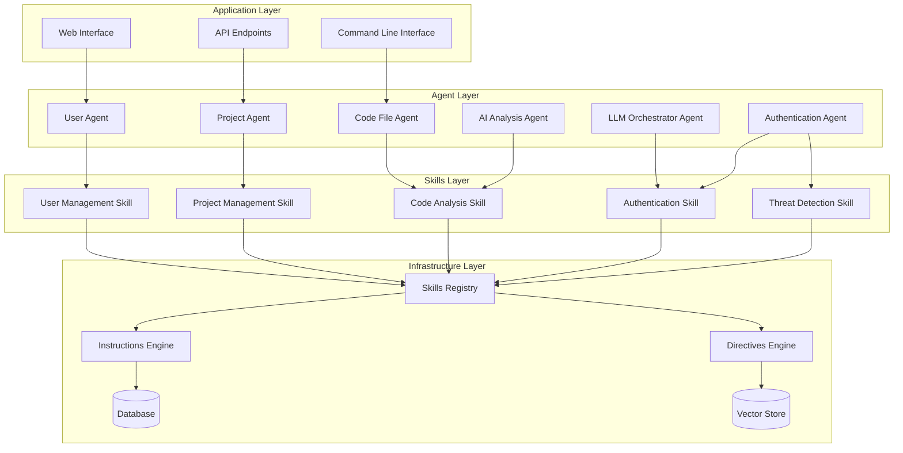

## Core Agents

### Domain Agents

#### UserAgent (`lib/rubber_duck/agents/user_agent.ex`)
- Manages user sessions and preferences
- Handles user behavior pattern recognition
- Provides proactive assistance suggestions
- Integrates with authentication system

#### ProjectAgent (`lib/rubber_duck/agents/project_agent.ex`)
- Manages project lifecycle and structure
- Provides dependency detection and management
- Monitors code quality continuously
- Generates refactoring suggestions

#### CodeFileAgent (`lib/rubber_duck/agents/code_file_agent.ex`)
- Analyzes code changes and quality
- Updates documentation automatically
- Tracks dependency impacts
- Provides performance optimization recommendations

#### AIAnalysisAgent (`lib/rubber_duck/agents/ai_analysis_agent.ex`)
- Schedules analysis tasks based on project activity
- Assesses result quality and learns from feedback
- Generates insights and discovers patterns
- Coordinates with LLM providers

### Infrastructure Agents

#### AuthenticationAgent (`lib/rubber_duck/agents/authentication_agent.ex`)
- Manages session lifecycle autonomously
- Detects threats and responds adaptively
- Implements dynamic security policies
- Provides behavioral authentication

#### TokenAgent (`lib/rubber_duck/agents/token_agent.ex`)
- Manages token lifecycle with predictive renewal
- Analyzes usage patterns for anomaly detection
- Implements automatic renewal strategies
- Detects security anomalies

#### PermissionAgent (`lib/rubber_duck/agents/permission_agent.ex`)
- Adjusts permissions dynamically based on context
- Provides context-aware access control
- Implements risk-based authentication
- Monitors privilege escalation

### Data Management Agents

#### DataPersistenceAgent (`lib/rubber_duck/agents/data_persistence_agent.ex`)
- Optimizes queries autonomously
- Manages connection pools adaptively
- Implements predictive data caching
- Suggests index optimizations

#### MigrationAgent (`lib/rubber_duck/agents/migration_agent.ex`)
- Executes migrations with intelligent rollback
- Validates data integrity automatically
- Predicts and mitigates performance impacts
- Makes rollback decisions based on failure patterns

#### QueryOptimizerAgent (`lib/rubber_duck/agents/query_optimizer_agent.ex`)
- Learns query patterns and optimizes them
- Rewrites queries automatically for performance
- Optimizes cache strategies based on usage
- Makes load balancing decisions with predictive scaling

## Skills System

### Core Skills Architecture

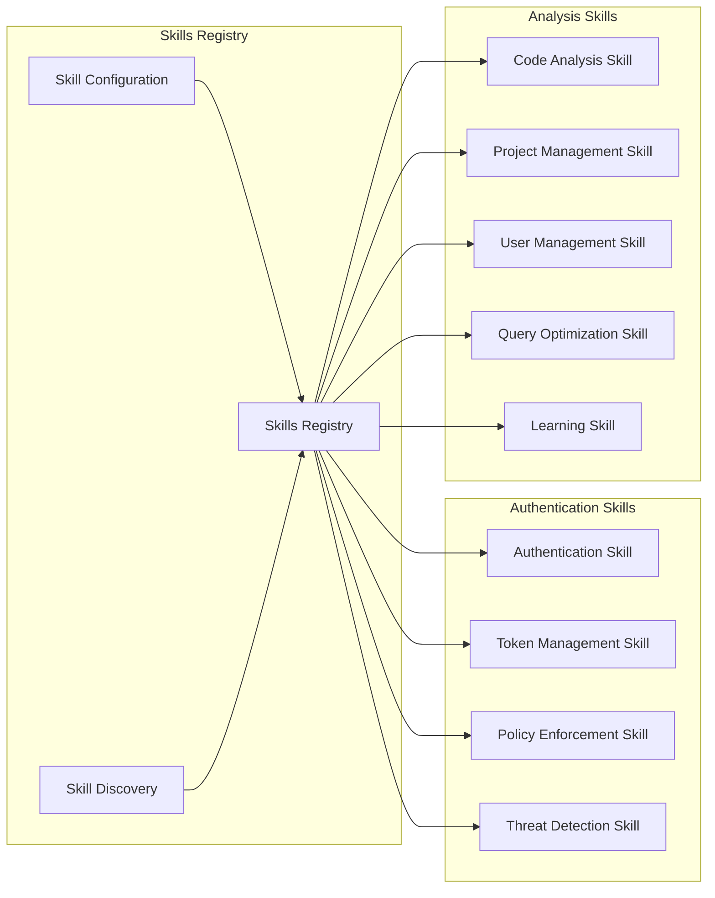

### Skills Implementation

Skills are located in `lib/rubber_duck/skills/` and provide:
- Reusable functionality across agents
- Configuration and composition capabilities
- Runtime modification support
- Hot-swapping for updates without restarts

## LLM Orchestration System

### Architecture

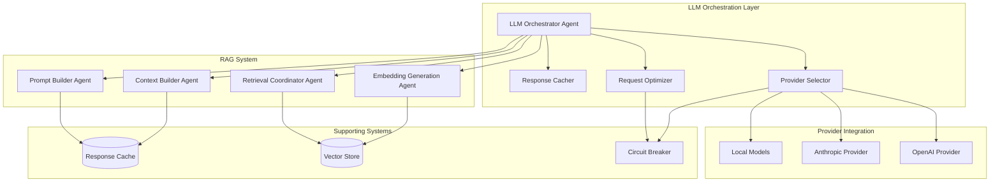

### Key Components

#### Provider Management
- Autonomous provider selection based on request characteristics
- Cost-quality optimization with learning from outcomes
- Intelligent routing with load balancing
- Circuit breaker patterns for failure handling

#### RAG Pipeline
- Multi-strategy retrieval (semantic, fulltext, hybrid)
- Reciprocal Rank Fusion for result combination
- Context optimization for token efficiency
- Quality assessment with RAG Triad metrics

## Data Layer Architecture

### Database Design

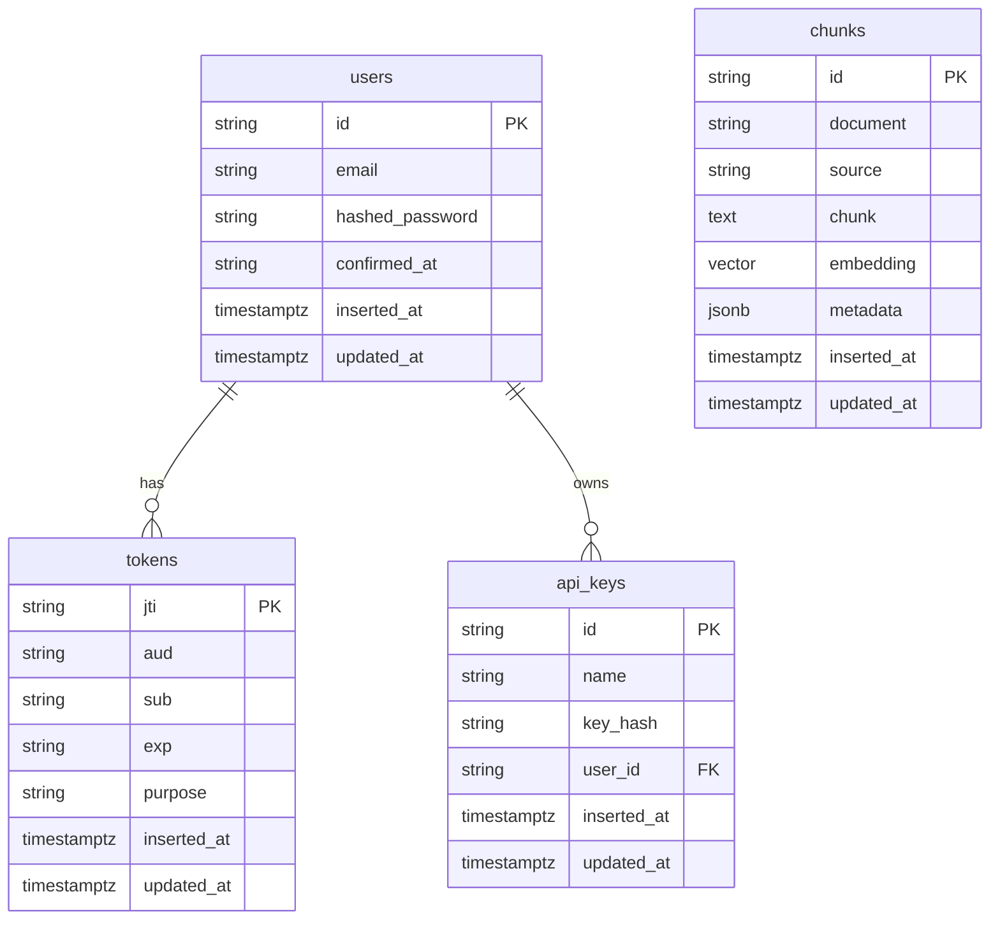

### Storage Systems
- **PostgreSQL**: Primary data storage with Ash resources
- **PGVector**: Vector embeddings for semantic search
- **ETS**: In-memory caching and session storage
- **Oban**: Background job processing

## Communication Patterns

### Signal-Based Communication

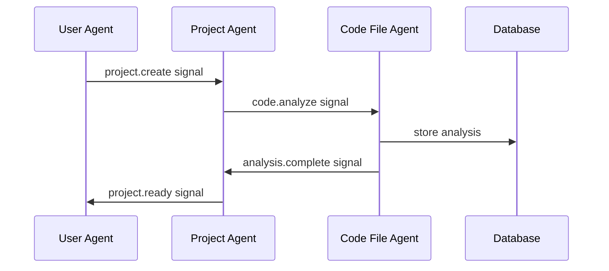

### Message Flow
- Agents communicate through structured signals
- Pub/Sub pattern for loose coupling
- Event sourcing for audit trails
- Circuit breakers for reliability

## Security Architecture

### Multi-Layer Security

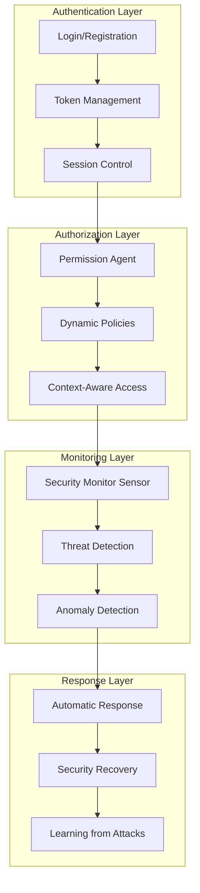

### Security Features
- Behavioral authentication with pattern analysis
- Adaptive security policies based on risk assessment
- Real-time threat detection and response
- Security event correlation and learning

## Workflow Orchestration

### Reactor Integration

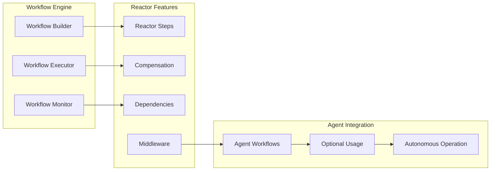

### Workflow Features
- Optional workflow orchestration for complex operations
- Compensation patterns for error recovery
- Dependency analysis for optimal execution order
- Agent autonomy preserved with workflow enhancement

## Performance and Scalability

### Concurrency Model

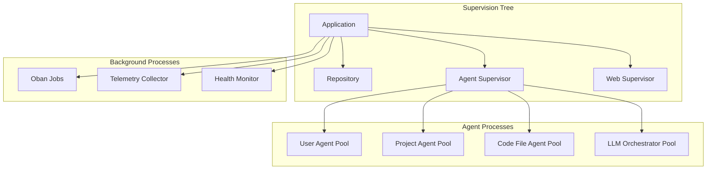

### Performance Features
- Dynamic process pools for agents
- ETS-based caching for fast data access
- Background job processing with Oban
- Circuit breakers for resilience
- Telemetry and monitoring for optimization

## Development Workflow

### Agent Development Lifecycle

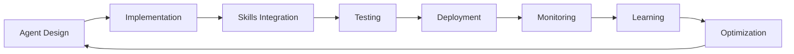

### Testing Strategy
- Unit tests for individual agent behaviors
- Integration tests for agent coordination
- Performance tests for scalability validation
- Chaos engineering for resilience testing

## Configuration Management

### Hierarchical Configuration

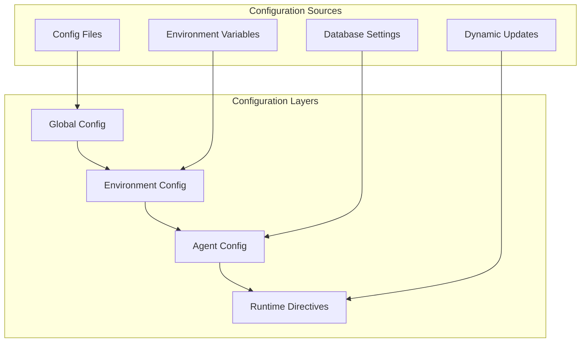

### Configuration Features
- Layered configuration with override capabilities
- Runtime configuration updates through Directives
- Environment-specific settings
- Agent-specific configuration options

## Monitoring and Observability

### Telemetry Architecture

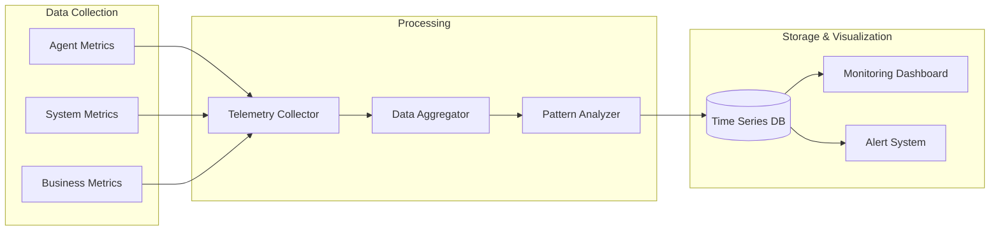

### Monitoring Features
- Real-time agent performance tracking
- System health monitoring
- Business metric collection
- Automated alerting and response

## Future Architecture Evolution

### Planned Enhancements

1. **Memory and Context Management**: Three-tier memory system with intelligent context optimization
2. **Communication Agents**: Enhanced inter-agent communication and coordination
3. **Security Enhancement**: Advanced threat detection and autonomous security responses
4. **Production Management**: Autonomous deployment and scaling capabilities
5. **Advanced Analysis**: Machine learning pipeline for pattern detection and code optimization

### Extensibility Points

- **New Agent Types**: Framework supports adding specialized agents
- **Additional Skills**: Modular skills can be developed independently
- **Provider Integration**: New LLM providers can be integrated easily
- **Workflow Enhancement**: Reactor-based workflows for complex orchestration
- **Custom Instructions**: Domain-specific instruction sets can be added

## Development Guidelines

### Adding New Agents
1. Define agent purpose and capabilities
2. Implement using `Jido.Agent` behavior
3. Create associated Skills for reusable functionality
4. Add appropriate tests and documentation
5. Register with supervision tree

### Creating Skills
1. Use `Jido.Skill` behavior for implementation
2. Define clear input/output signals
3. Implement configuration options
4. Ensure composability with other Skills
5. Add comprehensive tests

### Implementing Instructions
1. Define clear action parameters and outcomes
2. Implement error handling and compensation
3. Add telemetry and monitoring
4. Ensure idempotency where appropriate
5. Document usage patterns

### Using Directives
1. Define clear configuration schemas
2. Implement validation and safety checks
3. Ensure graceful fallback behavior
4. Add audit logging for changes
5. Test runtime modification scenarios

## Best Practices

### Code Organization
- Follow Ash Framework conventions
- Use Jido patterns for agent implementation
- Maintain clear separation between agents and skills
- Implement comprehensive error handling

### Testing Approach
- Test agent behaviors in isolation
- Validate agent coordination scenarios
- Use property-based testing for complex logic
- Implement chaos engineering for resilience

### Performance Optimization
- Use ETS for fast in-memory operations
- Implement circuit breakers for external dependencies
- Monitor and optimize agent communication patterns
- Use background jobs for non-critical operations

### Security Considerations
- Implement defense in depth
- Use behavioral authentication where appropriate
- Monitor and log security events
- Implement automatic threat response where safe

## Troubleshooting Guide

### Common Issues
- **Agent Startup Failures**: Check supervision tree configuration
- **Skill Loading Issues**: Verify Skills Registry initialization
- **Communication Problems**: Validate signal routing configuration
- **Performance Issues**: Review telemetry data and agent pool sizing

### Debugging Tools
- Agent state inspection via telemetry
- Signal flow tracing through PubSub logs
- Performance metrics dashboard
- Health check endpoints for system status

## Conclusion

The RubberDuck architecture provides a robust, scalable foundation for autonomous development assistance. The agent-based design enables independent component evolution while maintaining system cohesion through Skills, Instructions, and Directives. This architecture supports both current functionality and future enhancements while maintaining operational excellence and developer productivity.