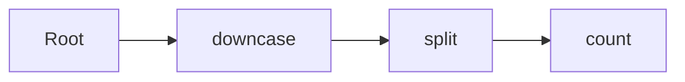
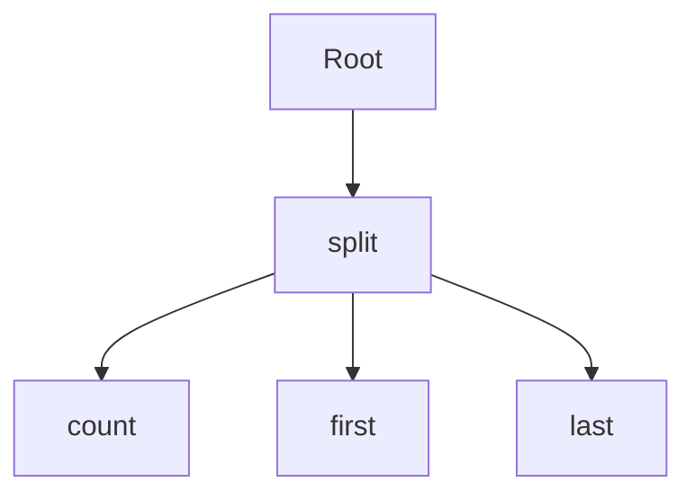
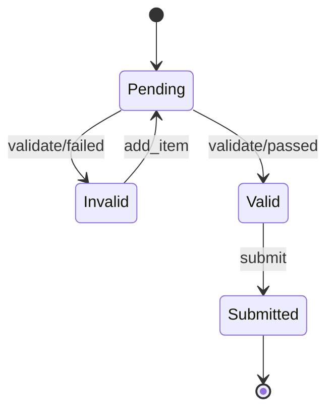
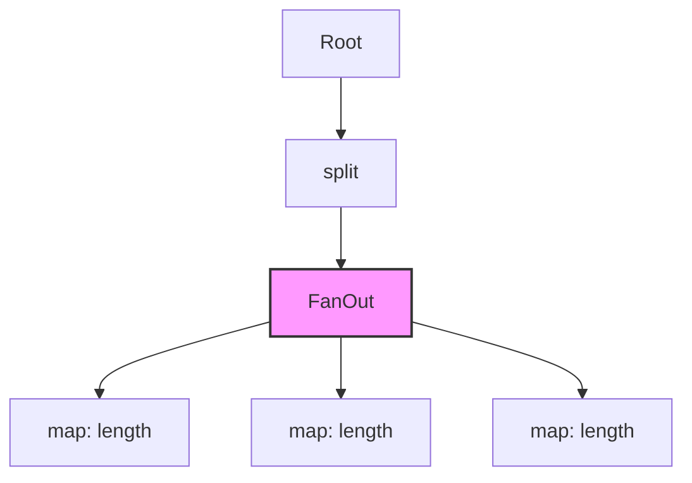
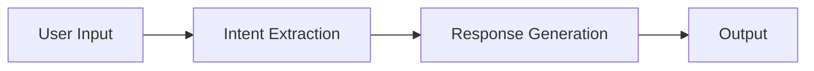
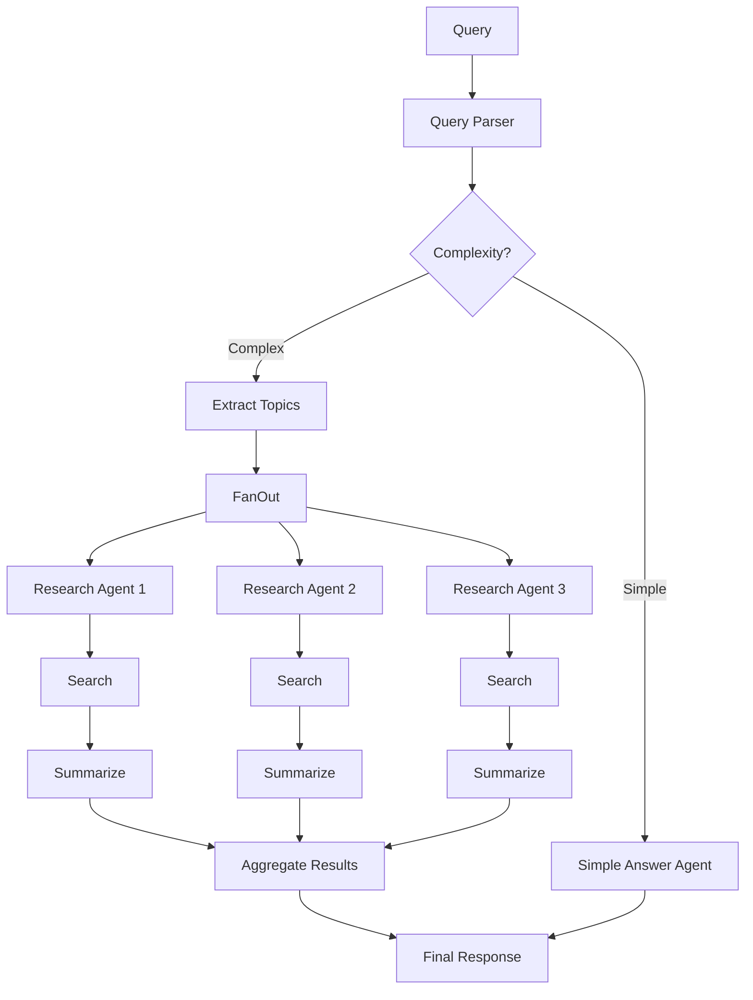
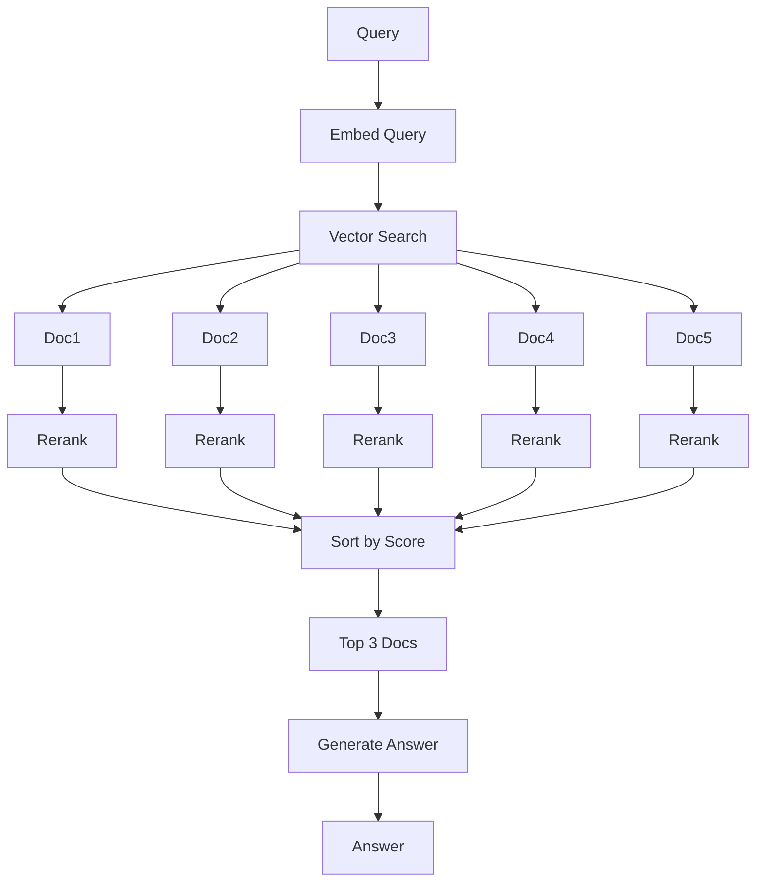
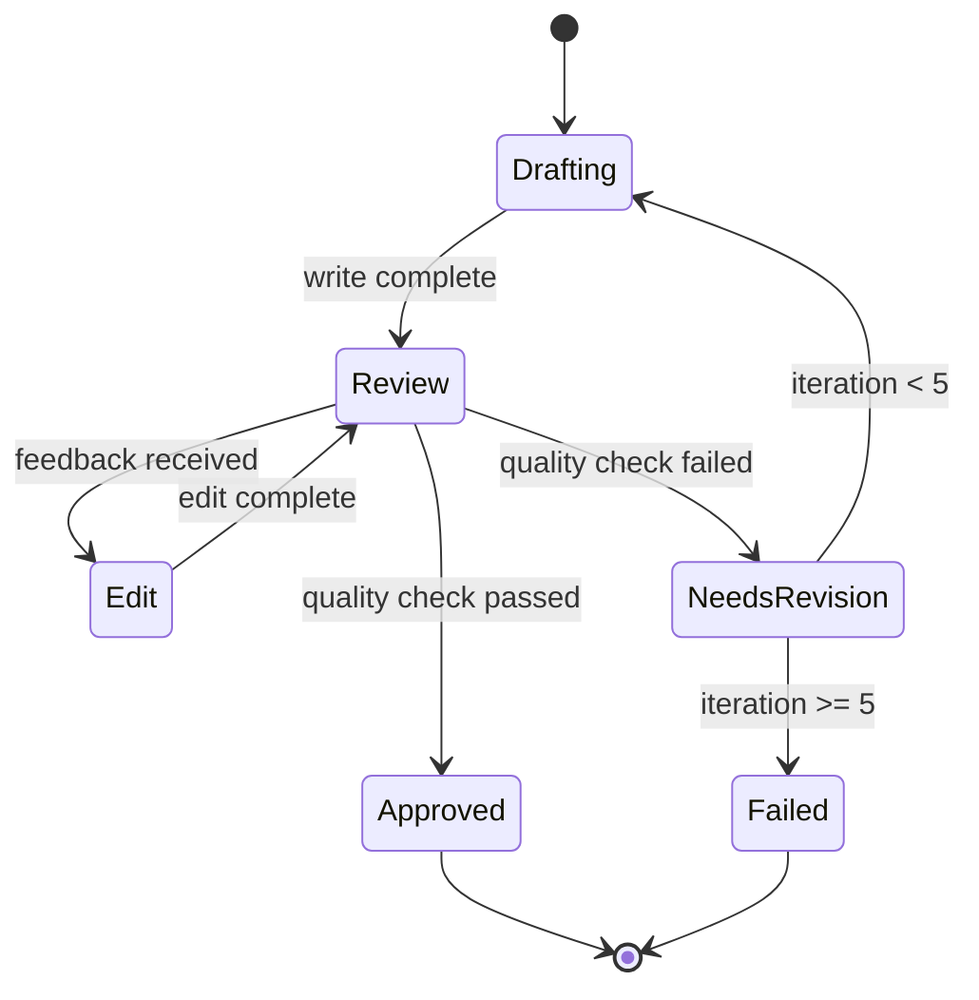
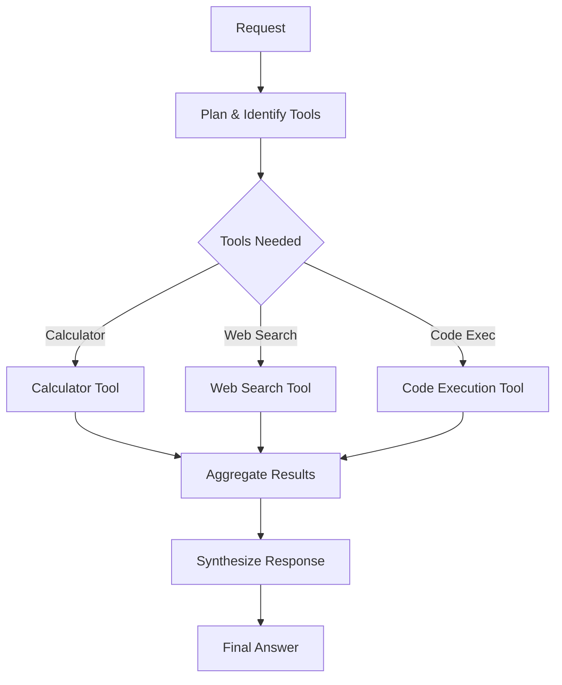

# Runic User Guide

A comprehensive guide to building dynamic, composable workflows with Runic.

## Table of Contents

1. [Introduction](#introduction)
2. [Core Concepts](#core-concepts)
3. [Components](#components)
   - [Steps](#steps)
   - [Rules](#rules)
   - [State Machines](#state-machines)
   - [Map/Reduce Operations](#mapreduce-operations)
   - [Accumulators](#accumulators)
4. [Workflow Composition](#workflow-composition)
5. [Evaluation Strategies](#evaluation-strategies)
6. [Advanced Patterns](#advanced-patterns)
7. [LLM Agentic Workflows](#llm-agentic-workflows)

## Introduction

Runic is a dataflow programming framework for Elixir that enables you to build workflows as data structures that can be composed, modified, and evaluated at runtime. Unlike traditional compiled code, Runic workflows are dynamic and can be constructed based on runtime conditions, user input, or external data.

### When to Use Runic

Runic is ideal for:
- **Expert Systems**: Where rules need to be added/modified at runtime
- **Dynamic Pipelines**: Data processing workflows that vary based on input
- **State Machines**: Complex stateful logic that needs runtime flexibility
- **User-Defined Workflows**: Low-code platforms where users define logic
- **LLM Agent Systems**: Orchestrating multiple AI agents with dynamic routing

### Core Philosophy

Runic treats computation as data. Every component (step, rule, state machine) is a data structure that can be:
- Composed with other components
- Modified at runtime
- Evaluated lazily or eagerly
- Distributed across processes

## Core Concepts

### Facts

Facts are the data that flows through your workflow. Any Elixir term can be a fact:

```elixir
# Simple facts
42
"hello"
%{user: "alice", age: 30}
[:ok, {:data, "value"}]
```

### Workflows

A workflow is a directed acyclic graph (DAG) where:
- **Nodes** are components (steps, rules, etc.)
- **Edges** represent data flow between components
- **Evaluation** proceeds from root to leaves based on facts

```elixir
require Runic
alias Runic.Workflow

# Simple linear workflow
workflow = Runic.workflow(
  name: "simple_pipeline",
  steps: [
    Runic.step(fn x -> x * 2 end),
    Runic.step(fn x -> x + 10 end)
  ]
)

# Evaluate with a fact
result = workflow
  |> Workflow.react_until_satisfied(5)
  |> Workflow.raw_productions()
# Returns: [10, 20]
```

### Components

Components are the building blocks of workflows. All components implement the `Invokable` protocol, allowing them to be executed within a workflow context.

## Components

### Steps

Steps are the simplest components - pure functions that transform input to output.

#### Basic Steps

```elixir
require Runic

# Anonymous function step
double = Runic.step(fn x -> x * 2 end)

# Named step
add_ten = Runic.step(
  name: :add_ten,
  work: fn x -> x + 10 end
)

# Multi-arity step
sum = Runic.step(fn a, b -> a + b end)

# Captured function step
tokenize = Runic.step(&String.split/1)
```

#### Step Composition

Steps can be composed in pipelines:

```elixir
# Linear pipeline
pipeline = Runic.workflow(
  steps: [
    Runic.step(fn text -> String.downcase(text) end),
    Runic.step(fn text -> String.split(text) end),
    Runic.step(fn words -> Enum.count(words) end)
  ]
)
```



#### Branching Pipelines

Steps can branch to multiple paths:

```elixir
# Branching pipeline using tuple syntax
analyzer = Runic.workflow(
  steps: [
    {Runic.step(&String.split/1), [
      Runic.step(&Enum.count/1),
      Runic.step(&List.first/1),
      Runic.step(&List.last/1)
    ]}
  ]
)
```



### Rules

Rules are conditional components with a left-hand side (condition) and right-hand side (reaction).

#### Basic Rules

```elixir
# Pattern matching rule
greeting_rule = Runic.rule(fn
  :morning -> "Good morning!"
  :evening -> "Good evening!"
  _ -> "Hello!"
end)

# Separate condition and reaction
validation_rule = Runic.rule(
  name: :validate_age,
  condition: fn %{age: age} -> age >= 18 end,
  reaction: fn user -> {:ok, user} end
)

# Guard clause rule
number_classifier = Runic.rule(fn
  n when n < 0 -> :negative
  n when n > 0 -> :positive
  _ -> :zero
end)
```

#### Rules in Workflows

```elixir
classifier_workflow = Runic.workflow(
  name: "number_classifier",
  rules: [
    Runic.rule(
      condition: fn n -> rem(n, 2) == 0 end,
      reaction: fn n -> {:even, n} end
    ),
    Runic.rule(
      condition: fn n -> rem(n, 2) != 0 end,
      reaction: fn n -> {:odd, n} end
    )
  ]
)

# Multiple rules can fire for the same input
result = classifier_workflow
  |> Workflow.react_until_satisfied(4)
  |> Workflow.raw_productions()
# Returns: [{:even, 4}]
```

```mermaid
graph TD
    R[Root] --> C1{even?}
    R --> C2{odd?}
    C1 -->|true| E[{:even, n}]
    C2 -->|true| O[{:odd, n}]
```

### State Machines

State machines in Runic allow you to model stateful workflows with reducers and reactors.

#### Basic State Machine

```elixir
# Simple counter state machine
counter = Runic.state_machine(
  name: "counter",
  init: %{count: 0},
  reducer: fn
    :increment, state -> %{state | count: state.count + 1}
    :decrement, state -> %{state | count: state.count - 1}
    {:add, n}, state -> %{state | count: state.count + n}
    :reset, _state -> %{count: 0}
  end,
  reactors: [
    fn %{count: count} when count >= 10 -> {:limit_reached, count} end,
    fn %{count: count} when count < 0 -> {:negative_count, count} end
  ]
)
```

#### Complex State Machine Example

```elixir
# Order processing state machine
order_processor = Runic.state_machine(
  name: "order_processor",
  init: %{
    status: :pending,
    items: [],
    total: 0,
    errors: []
  },
  reducer: fn
    {:add_item, item}, state ->
      %{state | 
        items: [item | state.items],
        total: state.total + item.price
      }
    
    :validate, %{items: []} = state ->
      %{state | status: :invalid, errors: ["No items in order"]}
    
    :validate, %{total: total} = state when total < 10 ->
      %{state | status: :invalid, errors: ["Minimum order $10"]}
    
    :validate, state ->
      %{state | status: :valid}
    
    :submit, %{status: :valid} = state ->
      %{state | status: :submitted}
    
    :submit, state ->
      %{state | errors: ["Cannot submit invalid order"]}
  end,
  reactors: [
    fn %{status: :submitted} = state -> 
      {:order_submitted, state.items, state.total} 
    end,
    fn %{status: :invalid, errors: errors} -> 
      {:validation_failed, errors}
    end
  ]
)
```



### Map/Reduce Operations

Map and reduce operations allow parallel processing of collections within workflows.

#### Map Operations

```elixir
# Simple map
double_all = Runic.map(fn x -> x * 2 end)

# Map with pipeline
process_words = Runic.map(
  {Runic.step(&String.downcase/1), [
    Runic.step(&String.length/1)
  ]}
)

# Named map for reference by reduce
word_processor = Runic.workflow(
  steps: [
    {Runic.step(fn text -> String.split(text) end), [
      Runic.map(
        fn word -> String.length(word) end,
        name: :word_lengths
      )
    ]}
  ]
)
```



#### Reduce Operations

```elixir
# Simple reduce
sum_all = Runic.reduce(0, fn x, acc -> acc + x end)

# Reduce with map reference
average_calculator = Runic.workflow(
  steps: [
    {Runic.step(fn -> 1..100 end), [
      Runic.map(fn x -> x * x end, name: :squares),
      Runic.reduce(0, fn x, acc -> acc + x end, map: :squares)
    ]}
  ]
)

# Complex map-reduce pipeline
text_stats = Runic.workflow(
  name: "text_statistics",
  steps: [
    {Runic.step(&String.split/1), [
      {Runic.map(
        {Runic.step(&String.downcase/1), [
          Runic.step(&String.length/1)
        ]},
        name: :process_words
      ), [
        Runic.reduce(
          %{total: 0, count: 0},
          fn len, acc ->
            %{
              total: acc.total + len,
              count: acc.count + 1
            }
          end,
          map: :process_words
        )
      ]}
    ]}
  ]
)
```

```mermaid
graph TD
    R[Root] --> Split
    Split --> FO[FanOut: process_words]
    FO --> W1[word1]
    FO --> W2[word2]
    FO --> W3[word3]
    W1 --> D1[downcase]
    W2 --> D2[downcase]
    W3 --> D3[downcase]
    D1 --> L1[length]
    D2 --> L2[length]
    D3 --> L3[length]
    L1 --> FI[FanIn: reduce]
    L2 --> FI
    L3 --> FI
    FI --> Result[{total, count}]
    style FO fill:#f9f,stroke:#333,stroke-width:2px
    style FI fill:#9ff,stroke:#333,stroke-width:2px
```

### Accumulators

Accumulators maintain state across multiple invocations:

```elixir
# Running average accumulator
running_avg = %Runic.Workflow.Accumulator{
  init: fn -> %{sum: 0, count: 0} end,
  reducer: fn value, state ->
    new_sum = state.sum + value
    new_count = state.count + 1
    %{
      sum: new_sum,
      count: new_count,
      average: new_sum / new_count
    }
  end
}

# Use in workflow
stats_workflow = Runic.workflow(
  steps: [
    running_avg,
    Runic.step(fn %{average: avg} -> {:current_average, avg} end)
  ]
)
```

## Workflow Composition

### Merging Workflows

Workflows can be combined dynamically:

```elixir
# Base workflow
base = Runic.workflow(
  name: "base",
  steps: [
    Runic.step(fn x -> x * 2 end)
  ]
)

# Extension workflow
extension = Runic.workflow(
  rules: [
    Runic.rule(fn
      n when n > 100 -> {:large, n}
      n -> {:small, n}
    end)
  ]
)

# Merge workflows
combined = Workflow.merge(base, extension)
```

### Dynamic Workflow Construction

```elixir
# Build workflow based on configuration
def build_pipeline(config) do
  steps = []
  
  steps = if config.normalize do
    [Runic.step(&String.downcase/1) | steps]
  else
    steps
  end
  
  steps = if config.tokenize do
    [Runic.step(&String.split/1) | steps]
  else
    steps
  end
  
  steps = if config.count do
    [Runic.step(&Enum.count/1) | steps]
  else
    steps
  end
  
  Runic.workflow(
    name: "dynamic_pipeline",
    steps: Enum.reverse(steps)
  )
end
```

### Hooks for Debugging and Monitoring

```elixir
monitored_workflow = Runic.workflow(
  name: "monitored",
  steps: [
    Runic.step(fn x -> x * 2 end, name: :doubler),
    Runic.step(fn x -> x + 1 end, name: :incrementer)
  ],
  before_hooks: [
    doubler: [
      fn _step, workflow, fact ->
        IO.puts("About to double: #{inspect(fact)}")
        workflow
      end
    ]
  ],
  after_hooks: [
    incrementer: [
      fn _step, workflow, fact ->
        IO.puts("Result after increment: #{inspect(fact)}")
        workflow
      end
    ]
  ]
)
```

## Evaluation Strategies

### React Until Satisfied

Evaluates the workflow until no new facts are produced:

```elixir
result = workflow
  |> Workflow.react_until_satisfied(input_fact)
  |> Workflow.raw_productions()
```

### Single Reaction

Performs one evaluation cycle:

```elixir
{workflow, productions} = Workflow.react(workflow, input_fact)
```

### Get Runnables

Returns unevaluated functions for external execution:

```elixir
runnables = Workflow.get_runnables(workflow, input_fact)
# Returns: [{function, args}, ...]
```

### Lazy Evaluation with GenStage

```elixir
defmodule WorkflowProducer do
  use GenStage

  def init(workflow) do
    {:producer, workflow}
  end

  def handle_demand(demand, workflow) when demand > 0 do
    runnables = Workflow.get_runnables(workflow, :next)
    {events, new_workflow} = execute_runnables(runnables, workflow)
    {:noreply, events, new_workflow}
  end
end
```

## Advanced Patterns

### Conditional Branching

```elixir
router = Runic.workflow(
  name: "conditional_router",
  steps: [
    Runic.step(fn data -> {:tagged, data} end)
  ],
  rules: [
    Runic.rule(
      condition: fn {:tagged, %{type: :email}} -> true; _ -> false end,
      reaction: fn {:tagged, data} -> process_email(data) end
    ),
    Runic.rule(
      condition: fn {:tagged, %{type: :sms}} -> true; _ -> false end,
      reaction: fn {:tagged, data} -> process_sms(data) end
    ),
    Runic.rule(
      condition: fn {:tagged, %{type: :push}} -> true; _ -> false end,
      reaction: fn {:tagged, data} -> process_push(data) end
    )
  ]
)
```

### Recursive Workflows

```elixir
# Factorial calculator using state machine
factorial = Runic.state_machine(
  name: "factorial",
  init: fn n -> %{n: n, result: 1, done: false} end,
  reducer: fn
    :compute, %{n: 0} = state -> 
      %{state | done: true}
    :compute, %{n: n, result: r} = state -> 
      %{state | n: n - 1, result: r * n}
  end,
  reactors: [
    fn %{done: false} -> :compute end,
    fn %{done: true, result: r} -> {:factorial, r} end
  ]
)
```

### Error Handling Patterns

```elixir
safe_pipeline = Runic.workflow(
  name: "safe_pipeline",
  steps: [
    Runic.step(fn data ->
      case validate(data) do
        :ok -> {:valid, data}
        {:error, reason} -> {:invalid, reason}
      end
    end)
  ],
  rules: [
    Runic.rule(
      condition: fn {:valid, _} -> true; _ -> false end,
      reaction: fn {:valid, data} -> process(data) end
    ),
    Runic.rule(
      condition: fn {:invalid, _} -> true; _ -> false end,
      reaction: fn {:invalid, reason} -> log_error(reason) end
    )
  ]
)
```

## LLM Agentic Workflows

### Basic LLM Chain

```elixir
# Simple LLM chain workflow
llm_chain = Runic.workflow(
  name: "llm_chain",
  steps: [
    # Extract user intent
    Runic.step(
      name: :intent_extraction,
      work: fn user_input ->
        prompt = "Extract the intent from: #{user_input}"
        %{
          intent: call_llm(prompt),
          original: user_input
        }
      end
    ),
    # Generate response based on intent
    Runic.step(
      name: :response_generation,
      work: fn %{intent: intent, original: original} ->
        prompt = "Generate a response for intent '#{intent}' to: #{original}"
        call_llm(prompt)
      end
    )
  ]
)
```



### Multi-Agent Orchestration

```elixir
# Complex multi-agent system
research_assistant = Runic.workflow(
  name: "research_assistant",
  steps: [
    # Parse query
    Runic.step(
      name: :query_parser,
      work: fn query ->
        %{
          query: query,
          topics: extract_topics(query),
          complexity: assess_complexity(query)
        }
      end
    )
  ],
  rules: [
    # Route to specialized agents based on complexity
    Runic.rule(
      name: :simple_query_handler,
      condition: fn %{complexity: c} -> c == :simple end,
      reaction: fn %{query: q} ->
        {:simple_answer, quick_answer_agent(q)}
      end
    ),
    Runic.rule(
      name: :complex_query_handler,
      condition: fn %{complexity: c} -> c == :complex end,
      reaction: fn data ->
        {:needs_research, data}
      end
    )
  ]
)

# Research workflow for complex queries
research_workflow = Runic.workflow(
  name: "research_workflow",
  steps: [
    # Fan out to multiple research agents
    {Runic.step(fn {:needs_research, data} -> data.topics end), [
      Runic.map(
        fn topic ->
          %{
            topic: topic,
            sources: search_agent(topic),
            summary: summarize_agent(topic)
          }
        end,
        name: :research_agents
      ),
      # Aggregate research results
      Runic.reduce(
        %{sources: [], summaries: []},
        fn result, acc ->
          %{
            sources: [result.sources | acc.sources],
            summaries: [result.summary | acc.summaries]
          }
        end,
        map: :research_agents
      )
    ]}
  ]
)

# Combine workflows
full_assistant = Workflow.merge(research_assistant, research_workflow)
```



### RAG (Retrieval Augmented Generation) Pipeline

```elixir
rag_pipeline = Runic.workflow(
  name: "rag_pipeline",
  steps: [
    # Embed query
    Runic.step(
      name: :embed_query,
      work: fn query ->
        %{
          query: query,
          embedding: generate_embedding(query)
        }
      end
    ),
    # Retrieve relevant documents
    Runic.step(
      name: :retrieve_docs,
      work: fn %{embedding: emb} ->
        vector_search(emb, limit: 5)
      end
    ),
    # Rerank documents
    {Runic.step(fn docs -> docs end), [
      Runic.map(
        fn doc ->
          %{
            doc: doc,
            score: rerank_score(doc)
          }
        end,
        name: :rerank
      ),
      Runic.reduce(
        [],
        fn scored_doc, acc ->
          sorted_insert(acc, scored_doc)
        end,
        map: :rerank
      )
    ]},
    # Generate answer with context
    Runic.step(
      name: :generate_answer,
      work: fn ranked_docs ->
        context = Enum.take(ranked_docs, 3)
        |> Enum.map(& &1.doc.content)
        |> Enum.join("\n\n")
        
        prompt = """
        Context:
        #{context}
        
        Question: #{query}
        
        Answer based on the context:
        """
        
        call_llm(prompt)
      end
    )
  ]
)
```



### Agent Collaboration with State

```elixir
# Collaborative writing system
writing_system = Runic.state_machine(
  name: "collaborative_writing",
  init: %{
    draft: "",
    iteration: 0,
    feedback: [],
    status: :drafting
  },
  reducer: fn
    {:write, prompt}, state ->
      draft = writer_agent(prompt, state.feedback)
      %{state | draft: draft, iteration: state.iteration + 1}
    
    {:review, _}, state ->
      feedback = critic_agent(state.draft)
      %{state | feedback: [feedback | state.feedback]}
    
    {:edit, _}, %{feedback: [latest | _]} = state ->
      edited = editor_agent(state.draft, latest)
      %{state | draft: edited}
    
    {:approve, _}, state ->
      %{state | status: :approved}
    
    {:reject, _}, state ->
      %{state | status: :needs_revision}
  end,
  reactors: [
    # Continue drafting if not approved
    fn %{status: :needs_revision, iteration: i} when i < 5 ->
      {:write, :continue}
    end,
    # Request review after writing
    fn %{status: :drafting, draft: d} when d != "" ->
      {:review, :request}
    end,
    # Edit after review
    fn %{feedback: [_ | _], status: :drafting} ->
      {:edit, :apply}
    end,
    # Final output when approved
    fn %{status: :approved, draft: final} ->
      {:final_document, final}
    end
  ]
)
```



### Tool-Using Agent

```elixir
# Agent with tool access
tool_agent = Runic.workflow(
  name: "tool_using_agent",
  steps: [
    # Understand request and identify needed tools
    Runic.step(
      name: :plan_tools,
      work: fn request ->
        plan = plan_agent(request)
        %{
          request: request,
          plan: plan,
          tools_needed: extract_tools(plan)
        }
      end
    )
  ],
  rules: [
    # Calculator tool
    Runic.rule(
      condition: fn %{tools_needed: tools} -> 
        :calculator in tools 
      end,
      reaction: fn %{plan: plan} ->
        expression = extract_math_expression(plan)
        {:calc_result, evaluate_expression(expression)}
      end
    ),
    # Web search tool
    Runic.rule(
      condition: fn %{tools_needed: tools} -> 
        :web_search in tools 
      end,
      reaction: fn %{plan: plan} ->
        query = extract_search_query(plan)
        {:search_results, web_search(query)}
      end
    ),
    # Code execution tool
    Runic.rule(
      condition: fn %{tools_needed: tools} -> 
        :code_exec in tools 
      end,
      reaction: fn %{plan: plan} ->
        code = extract_code(plan)
        {:exec_result, safe_eval(code)}
      end
    ),
    # Aggregate results
    Runic.rule(
      name: :aggregate_results,
      condition: fn 
        {:calc_result, _} -> true
        {:search_results, _} -> true
        {:exec_result, _} -> true
        _ -> false
      end,
      reaction: fn result ->
        # This will accumulate all tool results
        {:tool_output, result}
      end
    )
  ]
)

# Final response generation
response_generator = Runic.workflow(
  steps: [
    Runic.step(
      work: fn facts ->
        # Collect all tool outputs
        tool_outputs = facts
        |> Enum.filter(fn 
          {:tool_output, _} -> true
          _ -> false
        end)
        |> Enum.map(fn {:tool_output, out} -> out end)
        
        # Generate final response
        synthesize_response(tool_outputs)
      end
    )
  ]
)

# Combine into full system
tool_system = Workflow.merge(tool_agent, response_generator)
```



### Conversation Memory System

```elixir
# Conversation system with memory
conversation_system = Runic.state_machine(
  name: "conversation_memory",
  init: %{
    messages: [],
    context: %{},
    user_profile: %{},
    topic_shifts: 0
  },
  reducer: fn
    {:user_message, msg}, state ->
      # Detect topic shift
      topic_changed = detect_topic_shift(msg, state.messages)
      
      %{state |
        messages: [{:user, msg} | state.messages],
        topic_shifts: if(topic_changed, do: state.topic_shifts + 1, else: state.topic_shifts)
      }
    
    {:assistant_response, response}, state ->
      %{state |
        messages: [{:assistant, response} | state.messages]
      }
    
    {:update_context, key, value}, state ->
      %{state |
        context: Map.put(state.context, key, value)
      }
    
    {:learn_preference, pref}, state ->
      %{state |
        user_profile: Map.update(
          state.user_profile,
          :preferences,
          [pref],
          fn prefs -> [pref | prefs] end
        )
      }
  end,
  reactors: [
    # Generate response with context
    fn %{messages: [{:user, msg} | _]} = state ->
      context_prompt = build_context_prompt(state)
      response = generate_contextual_response(msg, context_prompt)
      {:assistant_response, response}
    end,
    
    # Summarize conversation if too long
    fn %{messages: msgs} when length(msgs) > 20 ->
      summary = summarize_conversation(msgs)
      {:update_context, :conversation_summary, summary}
    end,
    
    # Extract user preferences
    fn %{messages: [{:user, msg} | _]} ->
      case extract_preference(msg) do
        nil -> nil
        pref -> {:learn_preference, pref}
      end
    end
  ]
)
```

### Advanced Agent Patterns

```elixir
# Self-improving agent with feedback loops
learning_agent = Runic.workflow(
  name: "self_improving_agent",
  steps: [
    # Initial attempt
    Runic.step(
      name: :initial_attempt,
      work: fn task ->
        %{
          task: task,
          attempt: perform_task(task),
          iteration: 1
        }
      end
    ),
    
    # Self-evaluation
    Runic.step(
      name: :self_evaluate,
      work: fn %{attempt: attempt, task: task} = data ->
        evaluation = evaluate_performance(attempt, task)
        Map.put(data, :evaluation, evaluation)
      end
    )
  ],
  rules: [
    # Improve if not satisfactory
    Runic.rule(
      condition: fn %{evaluation: %{score: s}} -> s < 0.8 end,
      reaction: fn %{attempt: prev, evaluation: eval, iteration: i} = data ->
        improved = improve_based_on_feedback(prev, eval.feedback)
        %{data | 
          attempt: improved,
          iteration: i + 1
        }
      end
    ),
    
    # Stop if good enough or too many iterations
    Runic.rule(
      condition: fn 
        %{evaluation: %{score: s}} when s >= 0.8 -> true
        %{iteration: i} when i >= 5 -> true
        _ -> false
      end,
      reaction: fn %{attempt: final} ->
        {:final_result, final}
      end
    )
  ]
)

# Meta-learning system
meta_learner = Runic.state_machine(
  name: "meta_learner",
  init: %{
    strategies: %{},
    performance_history: [],
    current_strategy: :default
  },
  reducer: fn
    {:record_performance, task_type, strategy, score}, state ->
      history_entry = %{
        task_type: task_type,
        strategy: strategy,
        score: score,
        timestamp: DateTime.utc_now()
      }
      
      %{state |
        performance_history: [history_entry | state.performance_history],
        strategies: Map.update(
          state.strategies,
          task_type,
          %{strategy => [score]},
          fn task_strategies ->
            Map.update(task_strategies, strategy, [score], fn scores ->
              [score | scores]
            end)
          end
        )
      }
    
    {:select_strategy, task_type}, state ->
      best_strategy = find_best_strategy(state.strategies[task_type])
      %{state | current_strategy: best_strategy}
  end,
  reactors: [
    # Adapt strategy based on performance
    fn %{performance_history: history} when length(history) > 10 ->
      analysis = analyze_performance_trends(history)
      {:strategy_recommendation, analysis}
    end
  ]
)
```

## Best Practices

1. **Component Granularity**: Keep steps focused on single responsibilities
2. **Error Handling**: Use rules to handle error cases explicitly
3. **State Management**: Use state machines for complex stateful logic
4. **Performance**: Use map/reduce for parallel processing of collections
5. **Debugging**: Leverage hooks for visibility into workflow execution
6. **Composition**: Build complex workflows from simpler, tested components
7. **Testing**: Test components individually before composing

## Conclusion

Runic provides a powerful framework for building dynamic, composable workflows in Elixir. By treating computation as data, it enables runtime flexibility that's particularly valuable for expert systems, dynamic pipelines, and AI agent orchestration. The examples in this guide demonstrate how Runic's components can be combined to create sophisticated workflows that adapt to runtime conditions and scale with your needs.